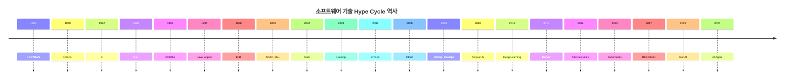

# 기술 Hype Cycle 역사 문서 작성 계획

## 목표
소프트웨어 기술의 Hype Cycle 역사를 연대기순으로 정리한 Obsidian 문서 작성

## 요구사항 요약

| 항목 | 결정 |
|------|------|
| 파일명 | `기술-Hype-Cycle-역사.md` |
| 저장 위치 | `003-RESOURCES/HISTORY/` (새 폴더 생성) |
| 시대 구분 | 연대기별 시간순 (1970s → 2020s) |
| 포함 범위 | Hype가 컸던 기술 중심 |
| 분석 깊이 | 중간 수준 (기술당 1-2문단 + 요약 표) |
| 시각화 | Mermaid 타임라인 |
| 핵심 서사 | 복합 (Hype Cycle 반복 + 추상화 계층 진화 + 생존자 편향) |
| 개인 경험 | 객관적 역사만 (개인 의견 최소화) |
| 기존 문서 연결 | 별도 문서 + 링크 |

## 포함할 기술 목록 (연대기순)

### 1970s 이전
- FORTRAN (1954) - 고급 언어 시작
- COBOL (1959) - "누구나 코딩" 약속

### 1970s-1980s
- C (1972) - 시스템 프로그래밍 혁명
- C++ (1983) - OOP 혁명 예고
- RPC (1980s) - 분산 컴퓨팅의 시작
- OLTP (1980s) - 트랜잭션 처리
- Pro*C (1980s) - 임베디드 SQL

### 1990s
- CORBA (1991) - 분산 객체의 꿈
- Java (1995) - "Write Once, Run Anywhere"
- Java Applet (1995) - 웹 애플리케이션의 환상
- EJB (1998) - 엔터프라이즈 컴포넌트 약속
- Visual Programming (1990s) - 드래그앤드롭 개발

### 2000s
- JSP/Servlet (1999) - 웹 개발 표준화
- SOAP/WS-* (2000) - 웹 서비스 표준화 시도
- XML/XSLT (2000s) - 데이터 교환의 만능 해결책
- Java Swing (2000s) - 데스크톱 GUI
- Template Engine (2000s) - 뷰 분리
- Ruby on Rails (2004) - "15분에 블로그 만들기"
- SOA (2000s) - 서비스 지향 아키텍처
- Hadoop (2006) - 빅데이터 혁명

### 2007-2012
- iPhone/ObjectiveC (2007) - 모바일 혁명
- Cloud Computing (2008) - 인프라의 민주화
- DevOps (2009) - 개발+운영 통합
- NoSQL (2009) - 관계형 DB 대체 약속
- Scala (2004/2010s) - JVM 위의 함수형
- AngularJS 1.x (2010) - SPA 프레임워크
- Flash/Silverlight - RIA의 꿈

### 2013-2019
- Big Data (2010s) - 데이터가 새 석유
- Deep Learning (2012-) - AI 부활
- Docker (2013) - 컨테이너 혁명
- Microservices (2014) - 모놀리스 탈출
- Kubernetes (2015) - 컨테이너 오케스트레이션
- Blockchain (2017) - 탈중앙화 만능 해결책
- Serverless (2014) - 서버 관리 종말

### 2020s
- GenAI (2022-) - "이번엔 진짜 개발자 대체?"
- AI Agent (2024-) - 자율 AI 에이전트

## 문서 구조

```markdown
# 기술 Hype Cycle 역사

## 개요
- 문서 목적
- 분석 관점 (Hype Cycle + 추상화 진화 + 생존자 편향)

## 타임라인 (Mermaid)
- 주요 기술들의 시각적 타임라인

## 1. 1970s 이전: 고급 언어의 시작
### FORTRAN (1954)
### COBOL (1959)

## 2. 1970s-1980s: 구조적 프로그래밍과 분산 컴퓨팅
### C (1972)
### C++ (1983)
### RPC, OLTP, Pro*C

## 3. 1990s: 객체지향과 분산 객체
### CORBA (1991)
### Java/Applet (1995)
### EJB (1998)
### Visual Programming

## 4. 2000s: 웹 서비스와 엔터프라이즈
### SOAP/WS-*, XML
### JSP, Swing, Template Engine
### Ruby on Rails, SOA
### Hadoop

## 5. 2007-2012: 모바일과 클라우드
### iPhone/ObjectiveC
### Cloud, DevOps
### NoSQL, Scala, AngularJS
### Flash/Silverlight

## 6. 2013-2019: 컨테이너와 데이터
### Big Data, Deep Learning
### Docker, Microservices, Kubernetes
### Blockchain, Serverless

## 7. 2020s: 생성형 AI
### GenAI
### AI Agent

## 패턴 분석
### Hype Cycle의 반복
### 추상화 계층의 진화
### 생존자 편향
### 제본스의 역설

## 결론
### 역사가 주는 교훈
### AI 시대에 적용

## 관련 문서
- [[AI-문제점-종합-분석]]
- [[Chapter-17-AIs-LLMs-and-God-Knows-What]]
- [[소프트웨어 코드 페티시즘]]
- [[AWS-reInvent-2025-Keynote-Werner-Vogels-Renaissance-Developer]]
```

## 구현 단계

### 1단계: 폴더 생성
```bash
mkdir -p ~/OneDrive/my-obsidian-vault/003-RESOURCES/HISTORY
```

### 2단계: 기술별 자료 조사
각 기술에 대해:
- 등장 년도 및 배경
- 당시의 기대/약속 (Hype)
- 실제 결과
- 대체/진화된 기술
- 교훈

### 3단계: Mermaid 타임라인 작성


### 4단계: 문서 작성
- frontmatter (tags, aliases, 날짜)
- 각 섹션 작성
- 관련 문서 링크 추가

### 5단계: 기존 문서에 링크 추가
- `AI-문제점-종합-분석.md`의 1.1 섹션에서 새 문서 참조

## 검증 방법
1. Obsidian에서 문서 열어 Mermaid 렌더링 확인
2. 모든 내부 링크([[...]]) 정상 작동 확인
3. 태그 체계 일관성 확인
4. 기존 문서와의 연결 확인

## 예상 결과물
- 파일: `003-RESOURCES/HISTORY/기술-Hype-Cycle-역사.md`
- 분량: 약 3000-5000 단어
- 기술 수: 약 30개
- Mermaid 타임라인 1개
- 요약 표 2-3개
