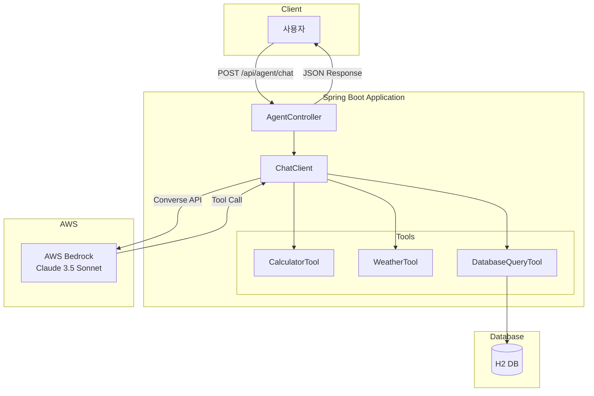
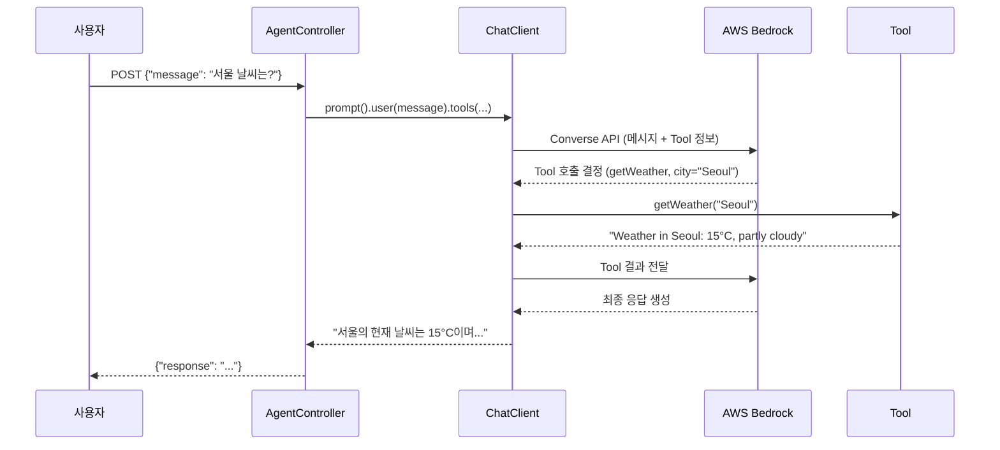

# bedrock-agent-demo 프로젝트 문서화 계획

## 목표
Spring Boot/Java에 익숙하지만 AI Agent에 대한 이해가 없는 개발자들이 이 프로젝트를 쉽게 이해할 수 있도록 체계적인 문서 작성

## 대상 독자
- Spring Boot, Java 경험자
- AI Agent, Tool Calling, LLM 개념 미숙지자

---

## 문서 구조

```
bedrock-agent-demo/
├── README.md                              # 프로젝트 개요 및 빠른 시작
├── docs/
│   ├── concepts/
│   │   └── ai-agent-fundamentals.md       # AI Agent 핵심 개념
│   ├── architecture/
│   │   └── system-architecture.md         # 시스템 아키텍처
│   ├── guides/
│   │   ├── getting-started.md             # 상세 설정 가이드
│   │   └── creating-custom-tools.md       # Tool 확장 가이드
│   └── plans/ (기존 유지)
└── scripts/ (기존 유지)
```

---

## 작업 및 커밋 계획

### Commit 1: README.md 생성
**파일**: `/README.md`

**내용**:
- 프로젝트 한 줄 소개
- 주요 기능 (3가지 Tool)
- 아키텍처 다이어그램 (Mermaid)
- 빠른 시작 (사전 요구사항, 실행, curl 테스트)
- 프로젝트 구조
- 기술 스택
- 다음 단계 (상세 문서 링크)

**커밋 메시지**:
```
docs: add comprehensive README with quick start guide
```

---

### Commit 2: AI Agent 개념 문서
**파일**: `/docs/concepts/ai-agent-fundamentals.md`

**내용**:
1. AI Agent란? (기존 LLM과의 차이)
2. Tool Calling이란? (LLM이 외부 기능을 호출하는 방식)
3. Tool Calling 동작 방식 (시퀀스 다이어그램)
4. Spring AI의 @Tool 패턴
   - @Tool 어노테이션 상세
   - @ToolParam 어노테이션 상세
   - Description의 중요성
5. AWS Bedrock Converse API 개요
6. 용어 정리 (Agent, Tool, Function Calling, RAG 등)

**커밋 메시지**:
```
docs: add AI Agent and Tool Calling concepts guide
```

---

### Commit 3: 시스템 아키텍처 문서
**파일**: `/docs/architecture/system-architecture.md`

**내용**:
1. 고수준 아키텍처 (컴포넌트 다이어그램)
2. 핵심 컴포넌트 상세
   - AgentController (역할, 코드 스니펫)
   - ChatClient (Builder 패턴, tools() 메서드)
   - Tools (CalculatorTool, WeatherTool, DatabaseQueryTool)
3. 데이터 흐름 (시퀀스 다이어그램)
4. 설정 상세 (AWS Bedrock, H2 Database)
5. 확장 포인트

**커밋 메시지**:
```
docs: add system architecture documentation
```

---

### Commit 4: 가이드 문서들
**파일**:
- `/docs/guides/getting-started.md`
- `/docs/guides/creating-custom-tools.md`

**getting-started.md 내용**:
- 사전 요구사항 (Java 21, AWS 계정)
- AWS 설정 (CLI, SSO, Bedrock 모델 접근)
- 프로젝트 실행 (클론, 빌드, 테스트, 실행)
- API 테스트 상세
- H2 Console 접근
- 문제 해결 가이드

**creating-custom-tools.md 내용**:
- Tool 생성 단계 (클래스, 어노테이션, 파라미터, 구현)
- Tool 등록 방법
- 예제: 환율 변환 Tool (TDD 방식)
- 베스트 프랙티스

**커밋 메시지**:
```
docs: add getting started and custom tool guides
```

---

## 주요 다이어그램

### 고수준 아키텍처 (README.md에 포함)


### Tool Calling 시퀀스 (개념 문서에 포함)


---

## 참조할 주요 파일

| 파일 | 용도 |
|------|------|
| `src/main/java/.../controller/AgentController.java` | ChatClient 사용 패턴 예제 |
| `src/main/java/.../tools/CalculatorTool.java` | @Tool 패턴 예제 |
| `src/main/java/.../tools/DatabaseQueryTool.java` | JPA 연동 Tool 예제 |
| `src/main/resources/application.yml` | 설정 예제 |
| `build.gradle.kts` | 의존성 예제 |

---

## 검증 방법

1. **문서 렌더링 확인**
   - GitHub에서 Mermaid 다이어그램 렌더링 확인
   - 마크다운 링크 동작 확인

2. **명령어 실행 확인**
   - README의 빠른 시작 명령어 직접 실행
   - curl 예제 테스트

3. **문서 간 연결 확인**
   - 모든 상호 참조 링크 동작 확인

---

## 작성 원칙

- 모든 문서는 **한국어**로 작성
- 코드 예제는 **실제 프로젝트 코드** 인용
- 다이어그램은 **Mermaid** 사용 (GitHub 렌더링 지원)
- 모든 명령어는 **직접 실행 가능**해야 함
