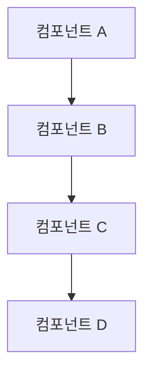
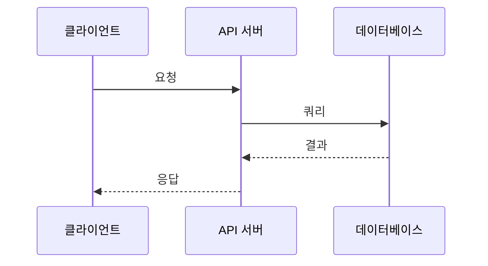
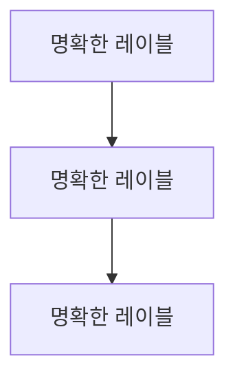
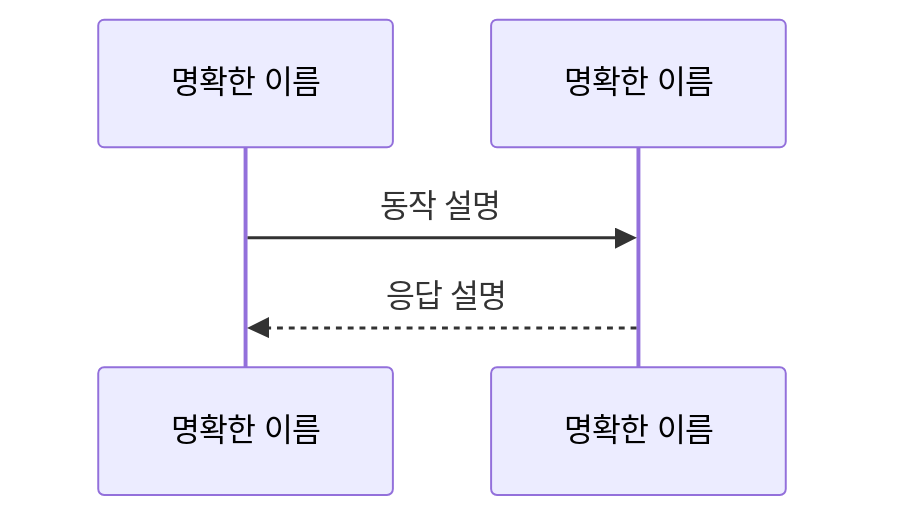

# Technical Documentation Guide Generator

신기술 스택 도입, 아키텍처 패턴, 구현 가이드를 분석하여 구조화된 기술 문서를 자동 생성하는 스킬입니다.

## 실행 절차

### 1. 정보 수집

다음 정보를 사용자에게 대화형으로 수집합니다:

- **프로젝트명**: 기술 문서를 작성할 프로젝트 이름
- **문서 주제**: 어떤 기술이나 아키텍처에 대한 문서인가
- **문서 목적**: 도입 가이드 / 아키텍처 설계 / 구현 가이드 / 마이그레이션 가이드 등
- **대상 독자**: 개발자 / 아키텍트 / 운영팀 / 경영진 등
- **기술 스택**: 관련된 기술, 프레임워크, 라이브러리
- **현재 상황**: 기존 시스템 현황 (해당되는 경우)
- **추가 요구사항**: 특별히 포함해야 할 내용

### 2. 코드베이스 분석

필요한 경우 현재 코드베이스를 분석:

- **프로젝트 구조**: 디렉토리 구조 파악
- **기존 패턴**: 현재 사용 중인 아키텍처 패턴
- **의존성**: 관련 라이브러리 및 버전
- **설정 파일**: 관련 설정 및 환경 변수

### 3. 기술 조사

필요한 경우 외부 자료 조사:

- **공식 문서**: 해당 기술의 공식 문서 참조
- **베스트 프랙티스**: 업계 표준 및 권장 사항
- **사례 연구**: 유사한 구현 사례
- **잠재적 이슈**: 알려진 문제점 및 해결 방법

### 4. 문서 구조화

수집된 정보를 바탕으로:

- **개요 작성**: 문서의 목적과 범위 정의
- **배경 설명**: 왜 필요한가, 어떤 문제를 해결하는가
- **아키텍처 설계**: 시스템 구조 및 컴포넌트 관계도
- **구현 가이드**: 단계별 구현 방법
- **코드 예시**: 실제 적용 가능한 코드
- **운영 가이드**: 배포, 모니터링, 트러블슈팅

### 5. 문서 생성 및 저장

정리된 정보를 구조화된 마크다운 문서로 생성하고, **Read 도구로 `~/.claude/policies/obsidian-document-policy.md`를 읽어 vault 경로, 파일명 규칙, 태그 체계, frontmatter 구조를 확인한 후 Obsidian vault에 저장**합니다.

## 기술 문서 템플릿

```markdown
# {문서 제목}

## 개요

### 목적

{이 문서의 목적과 다루는 범위}

### 대상 독자

{누구를 위한 문서인가}

### 전제 조건

{이 문서를 읽기 전에 필요한 지식이나 준비사항}

## 배경

### 동기

{왜 이 기술이나 아키텍처가 필요한가}

### 현재 상황

{기존 시스템의 현황 및 문제점}

### 기대 효과

{도입 또는 적용 후 기대되는 효과}

## 기술 개요

### 핵심 개념

{기술의 핵심 개념 및 원리}

### 주요 특징

- **특징 1**: {설명}
- **특징 2**: {설명}
- **특징 3**: {설명}

### 장단점 분석

#### 장점

- {장점 1}
- {장점 2}
- {장점 3}

#### 단점 및 고려사항

- {단점 1}
- {단점 2}
- {단점 3}

## 아키텍처 설계

### 시스템 구조



### 컴포넌트 구성

#### {컴포넌트 1}

**역할**: {이 컴포넌트가 하는 일}
**책임**: {주요 책임 사항}
**인터페이스**: {제공하는 API 또는 인터페이스}

#### {컴포넌트 2}

**역할**: {이 컴포넌트가 하는 일}
**책임**: {주요 책임 사항}
**인터페이스**: {제공하는 API 또는 인터페이스}

### 데이터 흐름



### 기술 스택

| 레이어 | 기술 | 버전 | 역할 |
|--------|------|------|------|
| Frontend | {기술명} | {버전} | {역할} |
| Backend | {기술명} | {버전} | {역할} |
| Database | {기술명} | {버전} | {역할} |
| Infrastructure | {기술명} | {버전} | {역할} |

## 구현 가이드

### 환경 설정

#### 필요한 도구

- {도구 1} (버전 {버전})
- {도구 2} (버전 {버전})
- {도구 3} (버전 {버전})

#### 설치 및 설정

```bash
# 의존성 설치
{설치 명령어}

# 환경 변수 설정
export KEY=value
```

### 단계별 구현

#### Step 1: {첫 번째 단계}

**목표**: {이 단계에서 달성할 목표}

**구현**:

```language
{코드 예시}
```

**설명**:
{코드 설명 및 주의사항}

#### Step 2: {두 번째 단계}

**목표**: {이 단계에서 달성할 목표}

**구현**:

```language
{코드 예시}
```

**설명**:
{코드 설명 및 주의사항}

### 설정 파일

#### {설정 파일 1}

**위치**: `{파일 경로}`

```language
{설정 파일 내용}
```

**설명**:
- `key1`: {설명}
- `key2`: {설명}
- `key3`: {설명}

## 코드 예시

### 기본 사용법

```language
{기본 사용 예시 코드}
```

### 고급 사용법

```language
{고급 사용 예시 코드}
```

### 실전 예제

**시나리오**: {실제 사용 사례 설명}

```language
{실전 예제 코드}
```

## 테스트

### 단위 테스트

```language
{단위 테스트 코드}
```

### 통합 테스트

```language
{통합 테스트 코드}
```

### 테스트 실행

```bash
{테스트 실행 명령어}
```

## 배포 가이드

### 배포 전 체크리스트

- [ ] {체크 항목 1}
- [ ] {체크 항목 2}
- [ ] {체크 항목 3}

### 배포 절차

1. **{단계 1}**
   ```bash
   {명령어}
   ```

2. **{단계 2}**
   ```bash
   {명령어}
   ```

3. **{단계 3}**
   ```bash
   {명령어}
   ```

### 롤백 절차

{문제 발생 시 롤백하는 방법}

```bash
{롤백 명령어}
```

## 운영 가이드

### 모니터링

#### 핵심 메트릭

- **{메트릭 1}**: {설명 및 임계값}
- **{메트릭 2}**: {설명 및 임계값}
- **{메트릭 3}**: {설명 및 임계값}

#### 모니터링 도구

{사용할 모니터링 도구 및 설정 방법}

### 로깅

#### 로그 레벨

- **ERROR**: {언제 사용}
- **WARN**: {언제 사용}
- **INFO**: {언제 사용}
- **DEBUG**: {언제 사용}

#### 로그 위치

{로그 파일 위치 및 로그 수집 방법}

### 트러블슈팅

#### 문제 1: {문제 설명}

**증상**: {어떤 증상이 나타나는가}
**원인**: {왜 발생하는가}
**해결 방법**: {어떻게 해결하는가}

```bash
{해결 명령어}
```

#### 문제 2: {문제 설명}

**증상**: {어떤 증상이 나타나는가}
**원인**: {왜 발생하는가}
**해결 방법**: {어떻게 해결하는가}

```bash
{해결 명령어}
```

## 성능 최적화

### 최적화 포인트

1. **{최적화 항목 1}**
   - 현재 상태: {현재 성능}
   - 개선 방법: {개선 방안}
   - 기대 효과: {기대되는 성능 향상}

2. **{최적화 항목 2}**
   - 현재 상태: {현재 성능}
   - 개선 방법: {개선 방안}
   - 기대 효과: {기대되는 성능 향상}

## 보안 고려사항

### 보안 위험

1. **{위험 1}**
   - 설명: {위험 내용}
   - 대응 방안: {어떻게 대응할 것인가}

2. **{위험 2}**
   - 설명: {위험 내용}
   - 대응 방안: {어떻게 대응할 것인가}

### 보안 베스트 프랙티스

- {베스트 프랙티스 1}
- {베스트 프랙티스 2}
- {베스트 프랙티스 3}

## 참고 자료

### 공식 문서

- [{문서명}]({URL})
- [{문서명}]({URL})

### 관련 아티클

- [{제목}]({URL}) - {간단한 설명}
- [{제목}]({URL}) - {간단한 설명}

### 사례 연구

- [{회사명 또는 프로젝트명}]({URL}) - {간단한 설명}

### 유용한 도구

- **{도구 1}**: {설명}
- **{도구 2}**: {설명}

## FAQ

### Q1: {자주 묻는 질문 1}

{답변}

### Q2: {자주 묻는 질문 2}

{답변}

### Q3: {자주 묻는 질문 3}

{답변}

## 용어 정리

- **{용어 1}**: {설명}
- **{용어 2}**: {설명}
- **{용어 3}**: {설명}

## 다음 단계

- [ ] {향후 개선 계획 1}
- [ ] {향후 개선 계획 2}
- [ ] {향후 개선 계획 3}
```

## 문서 저장

기술 문서 작성 완료 후, Read 도구로 `~/.claude/policies/obsidian-document-policy.md`를 읽어 저장 규칙을 확인하고 다음과 같이 저장합니다:

1. **프로젝트명 확인**: 사용자에게 프로젝트명 재확인
2. **문서명 확인**: 의미있는 파일명 제안 (예: `redis-caching-guide.md`)
3. **Frontmatter 생성**:
   - `type`: `technical-documentation`
   - `topic`: 주제
   - `purpose`: 목적
   - `audience`: 대상 독자
   - `status`: `Draft`
   - **태그**: `doctype/technical-guide`, `topic/{기술명}`, `status/draft`, `project/{프로젝트명}`
4. **파일명**: 사용자 지정 또는 `{문서명}.md`
5. **저장 경로**: `~/OneDrive/my-obsidian-vault/002-PROJECTS/{프로젝트명}/`

자세한 저장 규칙은 `~/.claude/policies/obsidian-document-policy.md` 참조.

## 대상 독자별 작성 요령

### 개발자 대상

- 코드 중심, 구현 세부사항 포함
- 단계별 구현 가이드 강조
- 실행 가능한 코드 예시 충분히 제공

### 아키텍트 대상

- 아키텍처 패턴, 설계 결정 중심
- 시스템 구조 다이어그램 강조
- 트레이드오프 분석 포함

### 운영팀 대상

- 배포, 모니터링, 트러블슈팅 중심
- 운영 절차 상세히 기술
- 문제 해결 가이드 포함

### 경영진 대상

- 비즈니스 가치, ROI, 위험도 중심
- 요약 및 핵심 내용 강조
- 기술 용어 최소화 또는 설명 포함

## Mermaid 다이어그램 규칙

### 시스템 구조도 (graph)



- 방향: TD (Top-Down), LR (Left-Right)
- 노드는 명확한 레이블 사용
- 화살표로 의존성 또는 데이터 흐름 표현

### 시퀀스 다이어그램 (sequenceDiagram)



- 시간 순서대로 상호작용 표현
- 동기 호출: `->>`, 비동기 응답: `-->`

## 제목 작성 규칙

- **명확성**: 문서의 내용을 정확히 반영
- **구체성**: 추상적이지 않고 구체적으로
- **예시**:
  - ✅ "Redis를 활용한 캐싱 전략 가이드"
  - ✅ "마이크로서비스 아키텍처 설계 문서"
  - ✅ "GraphQL API 구현 가이드"
  - ❌ "기술 문서" (너무 일반적)
  - ❌ "새로운 기술" (모호함)

## 문서 작성 원칙

1. **명확성**: 애매한 표현 지양, 명확하고 구체적으로
2. **완결성**: 문서만으로 이해하고 구현할 수 있도록
3. **최신성**: 버전 정보, 변경 이력 명시
4. **검증 가능성**: 예시 코드는 테스트된 것으로
5. **구조화**: 논리적 흐름, 계층 구조
6. **시각화**: 다이어그램으로 복잡한 내용 설명

## 실행 예시

```
User: 기술 문서 작성해줘
Assistant:
1. [정보 수집] 프로젝트명, 주제, 목적, 대상 독자 등 질문
2. [코드베이스 분석] 필요시 현재 프로젝트 구조 파악
3. [기술 조사] 필요시 공식 문서, 베스트 프랙티스 조사
4. [문서 구조화] 개요, 배경, 아키텍처, 구현 가이드 작성
5. [문서 생성] Read `~/.claude/policies/obsidian-document-policy.md` 후 저장
```
